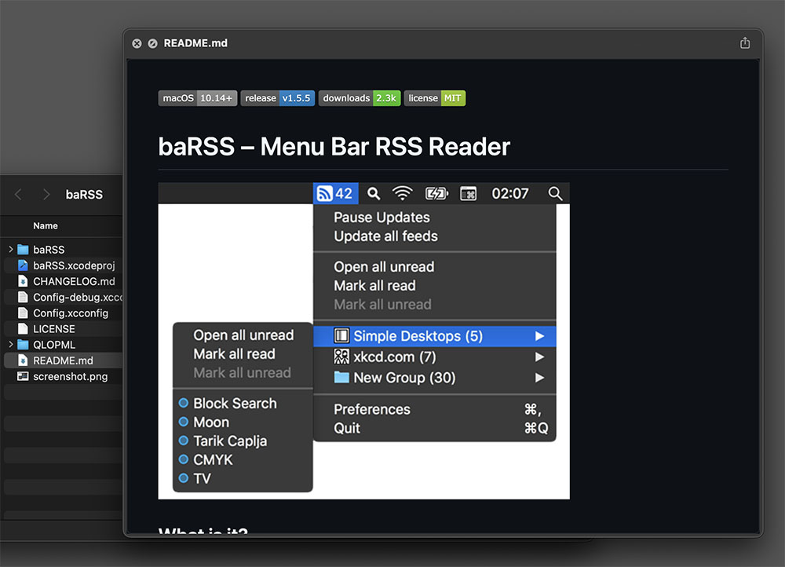

QLMarkdown
==========

Just a stupidly simple QuickLook plugin for Markdown files.

No fancy configuration options, just Github flavored Markdown.
But if you insist on modifying the stylesheet, you have full control over that.

## Scope of this project

This plugin is a wrapper around `swift-markdown` (which uses `cmark-gfm`) to convert markdown into html.
No external binary is bundled into the app, everything is compiled directly into the app bundle.
Output of the convert is passed, as is, to the preview window.
Styling is applied via CSS (customizable) and mimics the GitHub stylesheet.

There wont be any configuration options, nor finetuning which options are active, and no additional features.
If you want customizations, you can write your own css file.

## Dependencies

- <https://github.com/swiftlang/swift-markdown> (Apache 2.0)
- <https://github.com/sindresorhus/github-markdown-css> (MIT)

## Features

- Dark Mode
- Customizable CSS

### How to customize CSS

1. Right click on the app and select "Show Package Contents"
2. Copy `Contents/Resources/style.css` (or `markdown.css`)
3. Open `~/Library/Containers/de.relikd.QLMarkdown.Preview/Data/Documents/`
4. Paste the previous file and modify it to your liking

## Privacy & Security

Entitlements for the plugin allows access to all files (see [App Sandbox Temporary Exception Entitlements](https://developer.apple.com/library/archive/documentation/Miscellaneous/Reference/EntitlementKeyReference/Chapters/AppSandboxTemporaryExceptionEntitlements.html)).
This enables referencing local files (e.g., image, etc).

However, this is also a privacy risk.
A malicious QL plugin could send arbitrary file contents to a remote server.
Be careful what plugins you install. Especially if it has both entitlements `com.apple.security.temporary-exception.files` and `com.apple.security.network.client`.
Lucky for you, this open source project is very small and easy to review.
